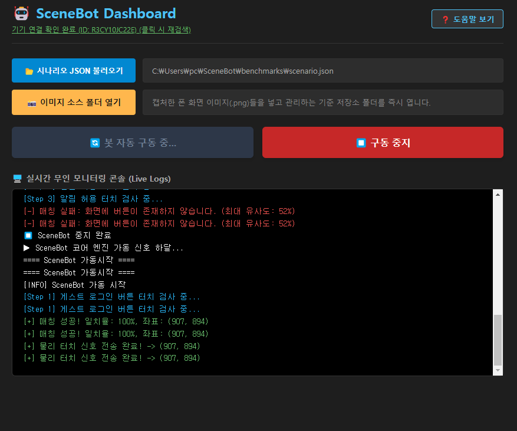
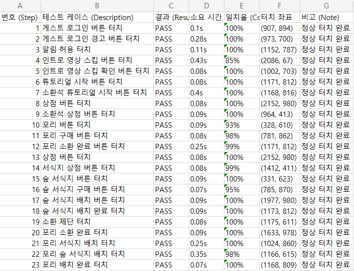

# SceneBot: OpenCV & ADB 기반 무인 가동 QA 자동화 대시보드 솔루션
> **프로젝트 기간:** 2026.06.04 ~ 2026.06.13 (1인 개발)

호스트 PC의 환경 오염(종속성)이 전혀 없는 순정 PC 환경에서도, 단일 포터블 패키지 실행만으로 안드로이드 단말기의 실시간 화면을 CV(Computer Vision) 연산하여 21개 테스트 스텝 무인 검증 및 표준 엑셀 리포트 자동 마감까지 완수하는 데스크톱 기반 QA 자동화 프레임워크입니다.



## Key Features (핵심 기능)
* **해상도 파편화 예외 처리 및 다중 스케일 알고리즘:** 타겟 리소스를 0.7x ~ 1.3x 범위로 동적 리사이징 연산하여 기기 파편화에 대응하고, 최초 매칭 성공률을 메모리에 가두는 **스케일 캐싱(Scale Caching)** 인프라를 통해 탐색 속도 최적화 완수.
* **하드웨어 커널 제어 (ADB 연동):** Android Debug Bridge(ADB) 가상 입력 버퍼를 활용하여 취득한 절대 좌표(X, Y)로 오차 없는 단말기 물리 터치 원격 유도.
* **Fault-Tolerance (연속 결함 비상 셧다운 가드):** 단말기 프리징 및 네트웍 단절로 인한 연속 5회 매칭 실패 감지 즉시, 백엔드 타이머 파괴 및 가동을 강제 중단하는 시스템 보호 안전 레버 구축.
* **Pandas 표준 엑셀 리포트 자동 마감:** 검사 완주 즉시 임시 수집 데이터프레임 구조를 타임스탬프가 각인된 `.xlsx` 표준 보고서 양식으로 일괄 일렉트론 루트 폴더 자동 출력 마감.



---

## Tech Stack (기술 스택)
* **Frontend:** React.js, TypeScript, Vite
* **Backend Framework:** Electron (IPC Main / Renderer Architecture)
* **Automation Code Engine:** Python 3.14, OpenCV (cv2), Pandas, Openpyxl, ADB

---

## System Architecture & Data Flow

```
[프론트엔드: React / Vite]
         │
         │ 1. 시나리오 로드 및 [▶️ 가동] 트리거 핸들러 발동
         ▼
 ─────────────────────────────────────────────────────────── IPC Bridge 채널 동기화 (main.ts)
         │
         ▼
[백엔드 코어: Electron Main Process]
         │
         ├─► 2. 1초 간격 비동기 무인 인터벌 엔진 가동 (setInterval)
         ├─► 3. ADB 가상 입력 버퍼를 찔러 기기 제어 (`adb shell screencap` & `pull`)
         │         │
         │         ▼ [단말기 실시간 화면 정착 완료]
         │
         └─► 4. 가상 독립 런타임 엔진 비동기 파이프라인 호출 (`exec`)
                   │
                   ▼
[코어 연산 엔진: match_finder.py.exe]
         │
         ├─► 5. OpenCV 다중 스케일 탐색 및 캐싱 기반 템플릿 매칭 연산
         │         │
         │         ├─► [SUCCESS] ➔ 좌표(X, Y) 리턴 ➔ Electron 백엔드가 단말기에 터치 전달 (`adb shell input tap`)
         │         └─► [FAIL]    ➔ 연속 실패 누적 카운팅 (5회 임계값 도달 시 타이머 즉각 파괴 및 강제 셧다운)
         │
         ▼ 6. 시나리오 완주 (Index >= Length)
[Pandas 리포트 생성기]
         │
         └─► 7. 수집된 PASS 로그 배열 데이터 가공 ➔ `reports/` 폴더 내 무결성 표준 엑셀 문서 자동 마감
```

1. **Vite Frontend (React):** 사용자가 JSON 시나리오 스크립트 파일을 로드하고 가동 트리거 신호 하달.
2. **Electron Backend:** IPC 채널을 통해 신호를 수신하고, 1초 간격의 무인 인터벌 엔진 가동 및 ADB 쉘을 찔러 실시간 단말기 캡처본 정착 유도.
3. **Python Core Engine:** 가상 독립 바이너리로 패키징된 커널이 OpenCV 템플릿 매칭 연산을 전개하고, 성공 좌표 스트림을 일렉트론 IPC 채널로 바이패스 송신 후 최종 Pandas 리포트 마감 연산 수행.

---

## Core Architecture Code (핵심 소스 코드)

### 1. Electron IPC Core & Automation Interval Loop (`main.ts`)
```typescript
// 시나리오 자동화 가동 요청 핸들러 및 비동기 인터벌 폭주 방어 로직
ipcMain.handle('start-automation', async (_event, scenarioPath: string) => {
  if (automationInterval) return { success: false, message: '이미 실행 중입니다.' }

  try {
    const scenarioData = fs.readFileSync(scenarioPath, 'utf8')
    const steps: ScenarioStep[] = JSON.parse(scenarioData)
    let currentStepIndex = 0
    collectedReports = []
    failCounter = 0

    const baseDir = path.dirname(scenarioPath)
    const appRootDir = app.isPackaged ? path.dirname(app.getPath('exe')) : app.getAppPath()
    const pythonScriptPath = join(appRootDir, 'match_finder.py')
    const reportOutputDir = join(appRootDir, 'reports')
    
    sendLogToUI('==== SceneBot 가동시작 ====')
    let isProcessing = false

    automationInterval = setInterval(async () => {
      if (isProcessing) return
      
      // [최종 고도화] 시나리오 완주 즉시 비동기 경합을 막기 위해 인터벌 루프부터 완전히 파괴
      if (currentStepIndex >= steps.length) {
        sendLogToUI('모든 시나리오 스텝이 완료되었습니다! 무인 루프를 종료하고 리포트 가공을 시작합니다.')
        
        if (automationInterval) {
          clearInterval(automationInterval)
          automationInterval = null
        }

        if (!collectedReports || collectedReports.length === 0) {
          sendLogToUI('[🚨 WARNING] 수집된 PASS 테스트 데이터가 존재하지 않아 리포트 마감을 취소합니다.')
          forceStopAutomation()
          return
        }

        if (!fs.existsSync(reportOutputDir)) {
          fs.mkdirSync(reportOutputDir, { recursive: true })
        }

        const tempJsonPath = join(app.getPath('userData'), 'temp_report.json')
        fs.writeFileSync(tempJsonPath, JSON.stringify(collectedReports), 'utf8')

        const userSitePackages = join(process.env.USERPROFILE || '', 'AppData', 'Roaming', 'Python', 'Python314', 'site-packages')
        const excelCmd = `set PYTHONPATH=${userSitePackages}&& set PYTHONIOENCODING=utf-8 && "${pythonScriptPath}.exe" "EXPORT" "${tempJsonPath}" "${reportOutputDir}"`
        
        isProcessing = true // 엑셀 작업 도중 타이머가 다시 침범하는 현상을 원천 방어
        
        exec(excelCmd, (excelError, excelStdout) => {
          if (excelError) {
            sendLogToUI(`[-] 최종 엑셀 리포트 생성 실패: ${excelError.message}`)
          } else {
            sendLogToUI(`[+] ${excelStdout.trim()}`)
          }
          sendLogToUI('[INFO] 시나리오 정상 완주 및 리포트 마감이 완료되어 SceneBot 가동을 안전하게 종료합니다.')
          isProcessing = false
          forceStopAutomation() // 최종 락 해제 및 프로세스 안착
        })
        return
      }
      // ... 후속 ADB 캡처 및 파이썬 바이너리 매칭 통신 제어 구역
  ```
  
### 2. OpenCV Multi-Scale Caching Engine (`match_finder.py`)

```python
def find_match_with_cache(screenshot_path, template_path):
    start_time = time.time()
    img_scene = cv2.imread(screenshot_path, cv2.IMREAD_GRAYSCALE)
    img_template = cv2.imread(template_path, cv2.IMREAD_GRAYSCALE)

    if img_scene is None or img_template is None:
        print("FAIL,0")
        return False

    # 캐시된 스케일이 있는지 확인하여 1:1 고속 매칭 최선 도입
    cached_scale = load_scale_cache(template_path)
    fast_match_success = False
    threshold = 0.82 

    if cached_scale is not None:
        resized_w = int(img_template.shape[1] * cached_scale)
        resized_h = int(img_template.shape[0] * cached_scale)
        
        if resized_w <= scene_w and resized_h <= scene_h:
            resized_template = cv2.resize(img_template, (resized_w, resized_h), interpolation=cv2.INTER_AREA)
            result = cv2.matchTemplate(img_scene, resized_template, cv2.TM_CCOEFF_NORMED)
            _, max_val, _, max_loc = cv2.minMaxLoc(result)
            
            if max_val >= threshold:
                fast_match_success = True
                best_max_val = max_val
                best_max_loc = max_loc
                best_scale = cached_scale

    # 캐시가 없거나 미달 시 다중 스케일 전수 스캔 알고리즘 작동
    if not fast_match_success:
        best_max_val = -1
        best_max_loc = None
        best_scale = 1.0

        if img_template.shape == img_scene.shape:
            result = cv2.matchTemplate(img_scene, img_template, cv2.TM_CCOEFF_NORMED)
            _, max_val, _, max_loc = cv2.minMaxLoc(result)
            best_max_val = max_val
            best_max_loc = max_loc
        else:
            for scale in np.linspace(0.7, 1.3, 7):
                resized_w = int(img_template.shape[1] * scale)
                resized_h = int(img_template.shape[0] * scale)
                if resized_w > scene_w or resized_h > scene_h: continue

                resized_template = cv2.resize(img_template, (resized_w, resized_h), interpolation=cv2.INTER_AREA)
                result = cv2.matchTemplate(img_scene, resized_template, cv2.TM_CCOEFF_NORMED)
                _, max_val, _, max_loc = cv2.minMaxLoc(result)

                if max_val > best_max_val:
                    best_max_val = max_val
                    best_max_loc = max_loc
                    best_scale = scale

        if best_max_val >= threshold:
            save_scale_cache(template_path, best_scale)
```

## 5. 트러블 슈팅 (Troubleshooting)
1. 비동기 프로세스 경합 조건으로 인한 리포트 무한 복제 결함
현상: 시나리오 완료 후 비동기 exec(excelCmd) 연산 중에도 백엔드의 setInterval 타이머가 클리어되지 않고 침범하여 1초 간격으로 파이썬 마감 코어를 중복 가동, 리포트 엑셀이 초 단위로 무한 복제 생성되는 결함 감지.

해결 조치: 완주 조건문 분입 즉시 인터벌 타이머 파괴 루프(clearInterval)를 전면 최상단에 강제 배치하고, 비동기 연산 중 추가 진입을 막는 이중 잠금 플래그(isProcessing)를 적용하여 단 1개의 무결성 엑셀 리포트만 정착 출력하도록 구조 개편 성공.

2. 가상 독립 패키징 프로세스 실행 파일명 단차 예외
현상: 외부 종속성 제거를 위해 PyInstaller 가상 런타임 빌드본을 결합하는 과정에서 일렉트론 백엔드의 스크립트 기반 문자열이 비표준 파일명(.py.exe)으로 조준되어 바이너리 가동 실패 및 입출력 스트림 데드락 발생.

해결 조치: 릴리즈 패키징 단계의 하드코딩된 탐색 주소를 배포 규격 실행 파일명으로 완벽 미러링 매칭 정착시켜, 파이썬 인터프리터가 유실된 순정 PC 환경에서도 완벽히 단독 이미지 연산을 수행하는 구조 확립.